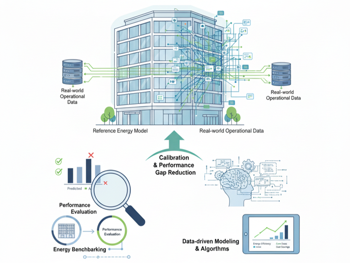
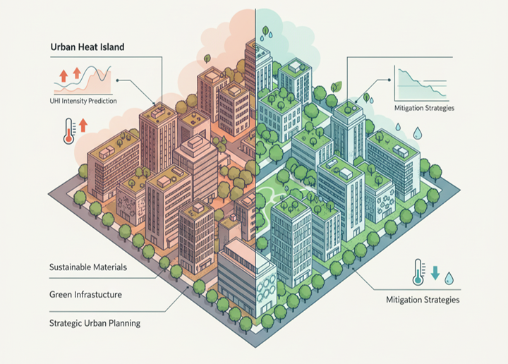
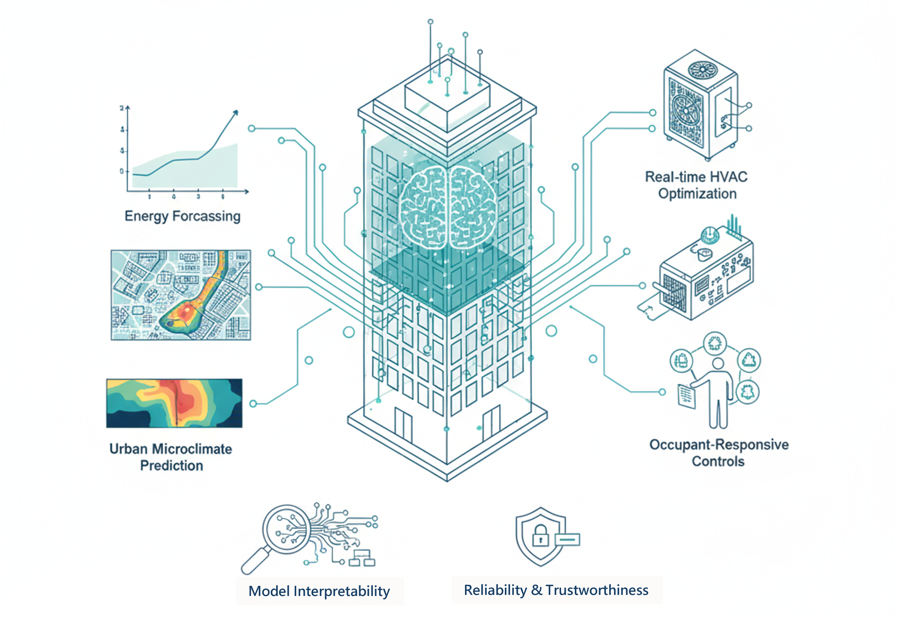

---

Our research is dedicated to advancing the sustainability and performance of buildings and
cities by focusing on the intricate interplay between energy systems, environmental quality, and
human well-being. We employ a multidisciplinary approach, integrating advanced modeling,
real-world monitoring, AI and data-driven approaches and human-centric evaluation to create
energy-efficient, comfortable, and healthy indoor and outdoor environments.

### 1. Occupant behaviour & Indoor Environmental Quality

 

**Overview:** 

This comprehensive research area places the human at the center of building design and
operation. We investigate the multifaceted aspects of Indoor Environmental Quality
(IEQ)—including visual, thermal, and air quality—and their collective impact on occupant well-
being, satisfaction, and productivity. Our work explores the nuanced relationship between the
physical environment (e.g., daylighting, window views) and subjective human perception, while
also modeling occupant behavior to bridge the gap between predicted and actual building
performance. By developing advanced daylighting systems, adaptive comfort models, and
holistic IEQ assessment frameworks, we aim to create indoor environments.

**Relevant Papers:** 

* "Nzivugira, P. D., Ngarambe, J., & Yun, G. (2022). Geographically extended occupant clothing behavior model using convolutional neural networks with hyperband technique. Journal of Building Engineering, 49, 104023."

* "Ngarambe, J., Kim, I., & Yun, G. Y. (2021). Influences of spectral power distribution on circadian energy, visual comfort and work performance. Sustainability, 13(9), 4852."

* "Kim, J. T., Lim, J. H., Cho, S. H., & Yun, G. Y. (2015). Development of the adaptive PMV model for improving prediction performances. Energy and Buildings, 98, 100-105."

* "Shin, J. Y., Yun, G. Y., & Kim, J. T. (2012). View types and luminance effects on discomfort glare assessment from windows. Energy and Buildings, 46, 139–145."

* "Shin, J. Y., Yun, G. Y., & Kim, J. T. (2012). Evaluation of daylighting effectiveness and energy saving potentials of light-pipe systems in buildings. Indoor and built environment, 21(1), 129-136."

* "Yun, G., Shin, J., & Kim, J. (2011). Influence of Window Views on the Subjective Evaluation of Discomfort Glare. Indoor and Built Environment, 20, 65–74."

* "Kim, J. T., Shin, J. Y., & Yun, G. Y. (2011). Prediction of discomfort glares from windows: Influence of the subjective evaluation of window views. Indoor and Built Environment, 21(1), 92–97."

* "Yun, G. Y., Kong, H. J., & Kim, J. T. (2011). A field survey of occupancy and air-conditioner use patterns in open plan offices. Indoor and Built Environment, 20(1), 137–147."

* "Yun, G. Y., & Steemers, K. (2011). Behavioural, physical and socio-economic factors in household cooling energy consumption. Applied Energy, 88(6), 2191-2200."

---

### 2. Building Energy Performance Analysis & Modeling

 

**Overview:** 

This foundational research theme is centered on improving energy efficiency across the building
stock through rigorous analysis and data-driven modeling. We develop and apply sophisticated
methodologies for energy benchmarking, allowing for the robust comparison and performance
evaluation of buildings. A key focus is on reducing the &quot;performance gap&quot; by creating advanced
calibration techniques that align simulation predictions with real-world operational data. Our
work includes the creation of reference energy models for various building typologies, providing
the essential frameworks needed to support evidence-based energy policies, building codes,
and high-performance design.

**Relevant Papers:** 

* "Bae, K., Kim, D., Choi, Y., Yun, G., & Moon, J. (2023). Development of an automatic calibration method of a VRF energy model for the design of energy efficient buildings. Journal of Building Engineering, 77, 107519."

* "Ngarambe, J., Yun, G. Y., & Kim, J. H. (2021). Quantile regression modelling with LightGBM for building energy benchmarking. Sustainable Cities and Society, 74, 103212."

* "Ngarambe, J., Yun, G. Y., & Kim, J. (2020). The role of geographic scale of weather data in urban building energy models. Energy and Buildings, 222, 110093."

* "Kim, D., & Yun, G. (2019). Development of reference energy models for office buildings in Korea. Energies, 12(12), 2269."

* "Kim, S., Kim, J., & Yun, G. Y. (2018). Development of energy benchmark model and confirmation of performance of domestic senior welfare facilities. Journal of the Architectural Institute of Korea, 34(12), 115-122."

---

### 3. Intelligent HVAC Systems & Control

 

**Overview:** 

This research concentrates on the core of building energy consumption: Heating, Ventilation,
and Air Conditioning (HVAC) systems. We focus on enhancing the performance of next-
generation HVAC technologies through advanced design, optimization, and intelligent control
logic. Our work involves developing dynamic, load-responsive control strategies for systems like
Variable Refrigerant Flow (VRF) and Electric Heat Pumps (EHP) to maximize efficiency under
variable operating conditions. The goal is to create highly responsive and energy-efficient HVAC
solutions that maintain optimal indoor comfort while minimizing operational costs and
environmental impact.

**Relevant Papers:** 

* "Kim, D. Y., Kim, D. E., & Yun, G. Y. (2023). A novel deep learning-based integrated photovoltaic energy storage system and EHP power prediction. Energies, 16(17), 6333."

* "Lee, H., Kim, D., Yun, G., & Moon, J. (2023). Development of an artificial neural network model for predicting the refrigerant charge amount in a heat pump system. Building and Environment, 244, 110826."

* "Go, S., Yun, G. Y., & Kim, J. (2021). Energy performance of direct expansion air handling unit in office buildings. Journal of Building Engineering, 44, 103233."

* "Kim, D., Yun, G., Kim, B., & Kim, J. (2020). Dynamic target high pressure control of a VRF system for heating energy savings. Energies, 13(20), 5293."

* "Kim, D., Yun, G., Kim, B., & Kim, J. (2019). Development and application of the load responsive control of the evaporating temperature in a VRF system for cooling energy savings. Energies, 12(23), 4434."

---

### 4. Sustainable Urban Systems & Climate Resilience

 

**Overview:** 

This research expands our focus from individual buildings to the urban scale, addressing critical
challenges of climate change and urban sustainability. We investigate the Urban Heat Island
(UHI) phenomenon, analyzing its causes, predicting its intensity, and assessing its impact on
public health and energy consumption. A key component of this work is evaluating tangible
mitigation strategies, including the application of sustainable materials (e.g., cool materials,
PCMs) and the integration of green infrastructure (e.g., green roofs, urban forestry). This
research connects material science with strategic urban planning to create more resilient and
sustainable built environments.

**Relevant Papers:** 

* "Kim, J., & Lee, D. (2023). The impact of urban warming on the mortality of vulnerable populations in Seoul. Environmental Research, 225, 115560."

* "Lee, D., & Kim, J. (2022). Synergies between urban heat island and heat waves in Seoul. Sustainable Cities and Society, 87, 104218."

* "Lee, H., Yun, G. Y., & Kim, J. (2022). Experimental and numerical study on the thermal performance and economic viability of a PCM-integrated floor heating system. Journal of Building Engineering, 52, 104445."

* "Ngarambe, J., Yun, G. Y., & Lee, D. (2021). Exploring the role of strategic urban planning and greening in decreasing surface urban heat island intensity. Journal of Urban Planning and Development, 147(3), 04021025."

* "Ngarambe, J., Yun, G. Y., & Kim, J. (2021). Influence of tree canopy coverage and leaf area density on urban heat island mitigation. Sustainable Cities and Society, 70, 102883."

* "Ngarambe, J., Yun, G. Y., & Santamouris, M. (2021). Investigating the impact of local climatic conditions and cool materials on the energy consumption of the urban building stock: a case study of Seoul. Energy and Buildings, 241, 110915."

---

### 5. Data-Driven Intelligence for the Built Environment

 

**Overview:** 

As a cutting-edge, cross-disciplinary research area, we leverage data science and artificial
intelligence to create intelligent, predictive, and self-optimizing building and urban systems. Our
work involves the application of various machine learning (ML) and deep learning (DL)
techniques to address complex challenges across all our research themes. Applications range
from forecasting building energy consumption and predicting urban microclimates to the real-
time optimization of HVAC operations and occupant-responsive environmental controls. We
focus on advancing model interpretability and reliability, ensuring that these data-driven
solutions are robust and trustworthy for real-world deployment.

**Relevant Papers:** 

* "Bae, K. W., Shin, D., Choi, Y. J., Yun, G. Y., & Moon, J. W. (2024). Energy-efficient virtual sensor-based deep reinforcement learning control of indoor CO2 in a kindergarten. Energy, 292, 130453."

* "Ngarambe, J., & Yun, G. Y. (2024). Recent advances in black box and white-box models for urban heat island prediction. Renewable and Sustainable Energy Reviews, 199, 114519."

* "Kim, D. E., & Yun, G. Y. (2023). Sequential attention deep learning architecture with unsupervised pre-training for interpretable and accurate building energy prediction. Energy and Buildings, 298, 113540."

* "Lee, S., & Yun, G. Y. (2022). Recent advances and effectiveness of machine learning models for fluid dynamics in the built environment. Buildings, 12(9), 1335."

* "Lee, S., & Yun, G. Y. (2021). Data-driven prediction of indoor airflow distribution in naturally ventilated residential buildings using combined CFD simulation and machine learning (ML) approach. Building and Environment, 206, 108344."

---