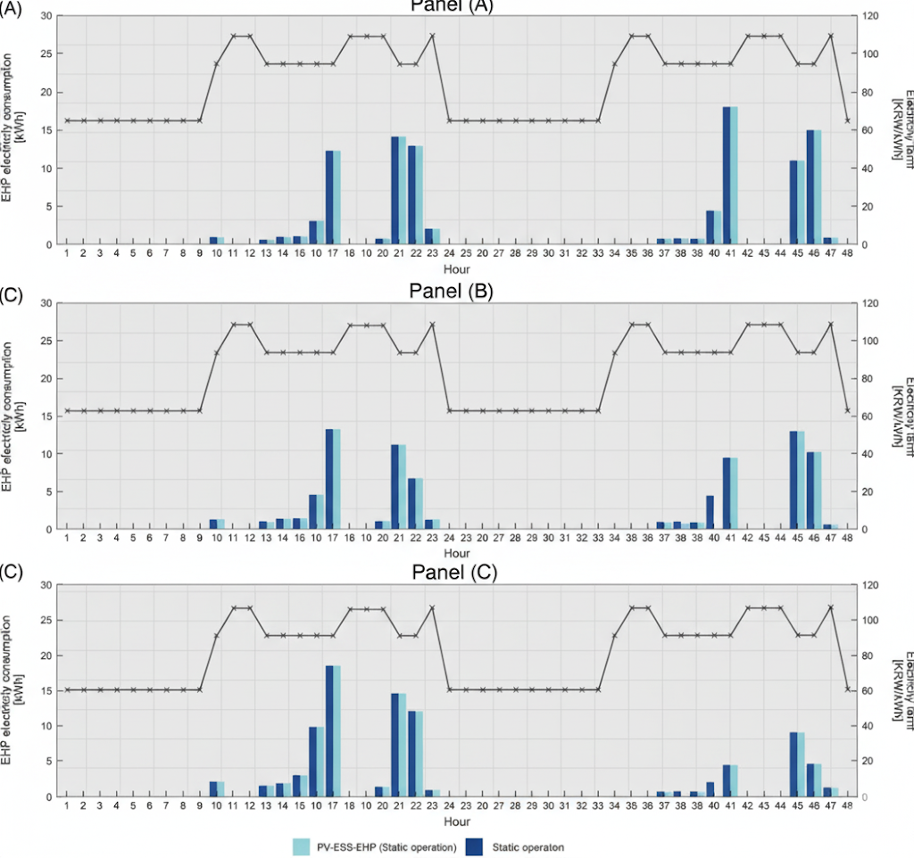

---

Our research is dedicated to advancing the sustainability and performance of buildings and
cities by focusing on the intricate interplay between energy systems, environmental quality, and
human well-being. We employ a multidisciplinary approach, integrating advanced modeling,
real-world monitoring, AI and data-driven approaches and human-centric evaluation to create
energy-efficient, comfortable, and healthy indoor and outdoor environments.

### 1. Occupant behaviour & Comfort

 

**Overview:** 

This comprehensive research area places the human at the center of building design and
operation. We investigate the multifaceted aspects of Indoor Environmental Quality
(IEQ)—including visual, thermal, and air quality—and their collective impact on occupant well-
being, satisfaction, and productivity. Our work explores the nuanced relationship between the
physical environment (e.g., daylighting, window views) and subjective human perception, while
also modeling occupant behavior to bridge the gap between predicted and actual building
performance. By developing advanced daylighting systems, adaptive comfort models, and
holistic IEQ assessment frameworks, we aim to create indoor environments.

**Relevant Papers:** 

* "Ngarambe, J., Duhirwe, P. N., Van Quang, T., Nzarigema, J. D. A., & Yun, G. Y. (2023). Coupling convolutional neural networks with gated recurrent units to model illuminance distribution from light pipe systems. Building and Environment, 237, 110276."

* "Ngarambe, J., Adilkhanova, I., Uwiragiye, B., & Yun, G. Y. (2022). A review on the current usage of machine learning tools for daylighting design and control. Building and Environment, 223, 109507."

* "Nzivugira, P. D., Ngarambe, J., & Yun, G. (2022). Geographically extended occupant clothing behavior model using convolutional neural networks with hyperband technique. Journal of Building Engineering, 49, 104023."

* "Ngarambe, J., Kim, I., & Yun, G. Y. (2021). Influences of spectral power distribution on circadian energy, visual comfort and work performance. Sustainability, 13(9), 4852."

* "Ngarambe, J., Irakoze, A., Yun, G. Y., & Kim, G. (2020). Comparative performance of machine learning algorithms in the prediction of indoor daylight illuminances. Sustainability, 12(11), 4471."

* "Ngarambe, J., Yun, G. Y., & Santamouris, M. (2020). The use of artificial intelligence (AI) methods in the prediction of thermal comfort in buildings: Energy implications of AI-based thermal comfort controls. Energy and Buildings, 211, 109807."

* "Ngarambe, J., Yun, G. Y., Lee, K., & Hwang, Y. (2019). Effects of changing air temperature at different sleep stages on the subjective evaluation of sleep quality. Sustainability, 11(5), 1417."

* "Yun, G. Y. (2018). Influences of perceived control on thermal comfort and energy use in buildings. Energy and Buildings, 158, 822-830."

* "Yun, G. Y., Lee, J. H., & Steemers, K. (2016). Extending the applicability of the adaptive comfort model to the control of air-conditioning systems. Building and Environment, 105, 13-23."

* "Kim, J. T., Lim, J. H., Cho, S. H., & Yun, G. Y. (2015). Development of the adaptive PMV model for improving prediction performances. Energy and Buildings, 98, 100-105."

* "Yun, G. Y., & Kim, J. T. (2014). Creating sustainable building through exploiting human comfort. Energy Procedia, 62, 590-594."

* "Yun, G. Y., Jung, H., & Kim, J. T. (2013). Energy-saving potential of LED lighting systems. Indoor and Built Environment, 22(1), 235-241."

* "Yun, G. Y., Kim, H., & Kim, J. T. (2013). Subjective responses to changes in spectral power distributions of LED light. Indoor and Built Environment, 22(1), 226-234."

* "Yun, G. Y., Kong, H. J., Kim, H., & Kim, J. T. (2012). A field survey of visual comfort and lighting energy consumption in open plan offices. Energy and Buildings, 46, 146-151."

* "Yun, G. Y., Kong, H. J., & Kim, J. T. (2012). The effect of seasons and prevailing environments on adaptive comfort temperatures in open plan offices. Indoor and built environment, 21(1), 41-47."

* "Kim, J. T., Shin, J. Y., & Yun, G. Y. (2012). Prediction of discomfort glares from windows: influence of the subjective evaluation of window views. Indoor and Built Environment, 21(1), 92-97."

* "Yun, G. Y., Kim, H., & Kim, J. T. (2012). Thermal and non-thermal stimuli for the use of windows in offices. Indoor and Built Environment, 21(1), 109-121."

* "Yun, G. Y., Kim, H., & Kim, J. T. (2012). Effects of occupancy and lighting use patterns on lighting energy consumption. energy and buildings, 46, 152-158."

* "Shin, J. Y., Yun, G. Y., & Kim, J. T. (2012). View types and luminance effects on discomfort glare assessment from windows. Energy and Buildings, 46, 139–145."

* "Shin, J. Y., Yun, G. Y., & Kim, J. T. (2012). Evaluation of daylighting effectiveness and energy saving potentials of light-pipe systems in buildings. Indoor and built environment, 21(1), 129-136."

* "Yun, G. Y., Kong, H. J., & Kim, J. T. (2012). The effect of seasons and prevailing environments on adaptive comfort temperatures in open plan offices. Indoor and built environment, 21(1), 41-47."

* "Jung, H. Y., Kim, H. I., Kim, G., & Yun, G. Y. (2012). Energy consumption by Spectral Power Distribution Of LED lighting. KIEAE Journal, 12(3), 101-106."

* "Shin, J. Y., Yun, G. Y., & Kim, J. T. (2011). Daylighting and energy performance prediction of a light pipe used in underground parking lots. In SHB2011-5th International Symposium on Sustainable Healthy Buildings, Seoul, Korea (pp. 277-281)."

* "Choi, J. D., & Yun, G. Y. (2011). A Preliminary Study the Effect of Occupancy Densities on Building Energy Consumption. 한국태양에너지학회: 학술대회논문집, 130-133."

* "Kim, H. I., Kim, J. T., & Yun, G. Y. (2011). Evaluation on the lighting performance of a dynamic LED lighting system. Journal of the Korean Solar Energy Society, 31(2), 113-119."

* "Kim, H., Kong, H. J., Choi, J. D., Kim, J. T., & Yun, G. Y. (2011). Window design and lighting control for low carbon buildings. In 13th International Conference on Civil, Structural and Environmental Engineering Computing, CC 2011."

* "Shin, J. Y., Yun, G. Y., & Kim, J. T. (2011). Daylight and energy performance of a light pipe system in an underground carpark. In 13th International Conference on Civil, Structural and Environmental Engineering Computing, CC 2011."

* "Kong, H. J., Yun, G. Y., & Kim, J. T. (2011). A field survey of thermal comfort in office building with thermal environment standard. KIEAE Journal, 11(3), 37-42."

* "Yun, G., Shin, J., & Kim, J. (2011). Influence of Window Views on the Subjective Evaluation of Discomfort Glare. Indoor and Built Environment, 20, 65–74."

* "Kim, J. T., Shin, J. Y., & Yun, G. Y. (2011). Prediction of discomfort glares from windows: Influence of the subjective evaluation of window views. Indoor and Built Environment, 21(1), 92–97."

* "Choi, J. D., Kim, H. I., & Yun, G. Y. (2011). Research on Development of a dynamic LED lighting system. 한국태양에너지학회: 학술대회논문집, 168-173."

* "Yun, G. Y., Kong, H. J., & Kim, J. T. (2011). A field survey of occupancy and air-conditioner use patterns in open plan offices. Indoor and Built Environment, 20(1), 137–147."

* "Yun, G. Y., & Steemers, K. (2011). Behavioural, physical and socio-economic factors in household cooling energy consumption. Applied Energy, 88(6), 2191-2200."

* "Yun, G. Y., Hwang, T., & Kim, J. T. (2010). Performance prediction by modelling of a light-pipe system used under the climate conditions of Korea. Indoor and Built Environment, 19(1), 137-144."

* "Yun, G. Y., Shin, H. Y., & Kim, J. T. (2010). Monitoring and evaluation of a light-pipe system used in Korea. Indoor and Built Environment, 19(1), 129-136."

* "Shin, J. Y., Yun, G. Y., & Kim, J. T. (2010). Preliminary Experiments on Discomfort Glare and Subjective Impressions from the Window Views. KIEAE Journal, 10(2), 25-30."

* "Shin, J. Y., Yun, G. Y., & Kim, J. T. (2010). Development and Validation of Sky Simulator for Reproducing CIE Overcast Sky Model. KIEAE Journal, 10(6), 97-103."

* "Yun, G. Y., Shin, J. Y., & Kim, J. T. (2010). Evaluation and Application of Prediction Models for the Daylight Performance of a Light-Pipe System. KIEAE Journal, 10(1), 65-72."

* "Kong, H. J., Lee, J. S., Kim, G., Yun, G. Y., & Kim, J. T. (2010). Validation of a Daylight Measurement System Using the CIE Guide of Recommended Practice of Daylight Measurement. KIEAE Journal, 10(6), 41-46."

* "Steemers, K., & Yun, G. Y. (2009). Household energy consumption: a study of the role of occupants. Building Research & Information, 37(5-6), 625-637."

* "Yun, G. Y., Tuohy, P., & Steemers, K. (2009). Thermal performance of a naturally ventilated building using a combined algorithm of probabilistic occupant behaviour and deterministic heat and mass balance models. Energy and buildings, 41(5), 489-499."

* "Jung, J. H., Moon, K. H., Yun, G. Y., & Kim, J. T. (2009). Pilot study of a mirror sunlighting system using scale model method. In 9th International Healthy Buildings Conference and Exhibition, HB 2009."

* "Yun, G. Y., & Steemers, K. (2008). Time-dependent occupant behaviour models of window control in summer. Building and environment, 43(9), 1471-1482."

* "Yun, G. Y., Steemers, K., & Baker, N. (2008). Natural ventilation in practice: linking facade design, thermal performance, occupant perception and control. Building Research & Information, 36(6), 608-624."

* "Yun, G. Y., & Steemers, K. (2007). User behaviour of window control in offices during summer and winter. In InProceeding of CISBAT international conference, Lausanne, Switzerland."

---

### 2. Building Energy Performance

 

**Overview:** 

This foundational research theme is centered on improving energy efficiency across the building
stock through rigorous analysis and data-driven modeling. We develop and apply sophisticated
methodologies for energy benchmarking, allowing for the robust comparison and performance
evaluation of buildings. A key focus is on reducing the &quot;performance gap&quot; by creating advanced
calibration techniques that align simulation predictions with real-world operational data. Our
work includes the creation of reference energy models for various building typologies, providing
the essential frameworks needed to support evidence-based energy policies, building codes,
and high-performance design.

**Relevant Papers:** 

* Duhirwe, P. N., Ngarambe, J., & Yun, G. Y. (2024). Causal effects of policy and occupant behavior on cooling energy. Renewable and Sustainable Energy Reviews, 206, 114854.

* "Bae, K., Kim, D., Choi, Y., Yun, G., & Moon, J. (2023). Development of an automatic calibration method of a VRF energy model for the design of energy efficient buildings. Journal of Building Engineering, 77, 107519."

* "Kolokotsa, D., Santamouris, M., & Yun, G. Y. (2022). 3.19-passive solar architecture. In Comprehensive Renewable Energy, Second Edition: Volume 1-9 (pp. 725-741). Elsevier."

* "Ngarambe, J., Yun, G. Y., & Kim, J. H. (2021). Quantile regression modelling with LightGBM for building energy benchmarking. Sustainable Cities and Society, 74, 103212."

* "Gassar, A. A. A., Yun, G. Y., Kim, S., & Han, C. H. (2020). Energy and feasibility analysis of applying bio-based phase change materials to buildings in East Asia. Journal of Green Building, 15(2), 157-181."

* "Ngarambe, J., Yun, G. Y., & Kim, J. (2020). The role of geographic scale of weather data in urban building energy models. Energy and Buildings, 222, 110093."

* "Kim, D., & Yun, G. (2019). Development of reference energy models for office buildings in Korea. Energies, 12(12), 2269."

* "Zo, C. H., & Yun, G. Y. (2019). Monthly heating energy needs analysis according to ISO 13790 and ISO 52016. Journal of the Korean Solar Energy Society, 39(5), 11-28."

* "Cho, H. M., Park, J. H., Wi, S., Chang, S. J., Yun, G. Y., & Kim, S. (2019). Energy retrofit analysis of cross-laminated timber residential buildings in Seoul, Korea: Insights from a case study of packages. Energy and Buildings, 202, 109329."

* "Kim, S., Kim, J., & Yun, G. Y. (2018). Development of energy benchmark model and confirmation of performance of domestic senior welfare facilities. Journal of the Architectural Institute of Korea, 34(12), 115-122."

* "Yun, G. Y., Kwok, A., Steemers, K., & Grondzik, W. T. (2018). New and advanced materials and technologies in ultralow-energy buildings. Advances in Civil Engineering, 2018, 1-2."

* "Gassar, A. A. A., & Yun, G. Y. (2017). Energy saving potential of PCMs in buildings under future climate conditions. Applied Sciences, 7(12), 1219."

* "Kim, S., Chang, J. D., Yun, G. Y., & Kim, S. (2017). Polymer composites for passive control system of buildings. International Journal of Polymer Science, 2017."

* "Choi, J. D., Choi, D. S., & Yun, G. Y. (2012). A simulation appraisal of energy performance in office building by different types of air-conditioning. Korean Journal of Air-Conditioning and Refrigeration Engineering, 24(8), 612-620."

* "Yun, G. Y., & Steemers, K. (2010). Night-time naturally ventilated offices: Statistical simulations of window-use patterns from field monitoring. Solar Energy, 84(7), 1216-1231."

* "Yun, G. Y., Kong, H. J., & Kim, J. T. (2010). A field survey of indoor environments and air-conditioner use patterns in open plan offices."

* "Yun, G. Y., Tuohy, P., & Steemers, K. (2009). Thermal performance of a naturally ventilated building using a combined algorithm of probabilistic occupant behaviour and deterministic heat and mass balance models. Energy and buildings, 41(5), 489-499."

* "Yun, G. Y., McEvoy, M., & Steemers, K. (2007). Design and overall energy performance of a ventilated photovoltaic façade. Solar Energy, 81(3), 383-394."

---

### 3. Advanced HVAC Systems & Control

 

**Overview:** 

This research concentrates on the core of building energy consumption: Heating, Ventilation,
and Air Conditioning (HVAC) systems. We focus on enhancing the performance of next-
generation HVAC technologies through advanced design, optimization, and intelligent control
logic. Our work involves developing dynamic, load-responsive control strategies for systems like
Variable Refrigerant Flow (VRF) and Electric Heat Pumps (EHP) to maximize efficiency under
variable operating conditions. The goal is to create highly responsive and energy-efficient HVAC
solutions that maintain optimal indoor comfort while minimizing operational costs and
environmental impact.

**Relevant Papers:** 

* "Kim, D. Y., Kim, D. E., & Yun, G. Y. (2023). A novel deep learning-based integrated photovoltaic energy storage system and EHP power prediction. Energies, 16(17), 6333."

* "Lee, H., Kim, D., Yun, G., & Moon, J. (2023). Development of an artificial neural network model for predicting the refrigerant charge amount in a heat pump system. Building and Environment, 244, 110826."

* "Go, S., Yun, G. Y., & Kim, J. (2021). Energy performance of direct expansion air handling unit in office buildings. Journal of Building Engineering, 44, 103233."

* "Hwang, J. K., Yun, G. Y., Lee, S., Seo, H., & Santamouris, M. (2020). Using deep learning approaches with variable selection process to predict the energy performance of a heating and cooling system. Renewable Energy, 149, 1227-1245."

* "Kim, D., Yun, G., Kim, B., & Kim, J. (2020). Dynamic target high pressure control of a VRF system for heating energy savings. Energies, 13(20), 5293."

* "Kim, D., Yun, G., Kim, B., & Kim, J. (2019). Development and application of the load responsive control of the evaporating temperature in a VRF system for cooling energy savings. Energies, 12(23), 4434."

* "Jo, S. H., Kim, J. T., & Yun, G. Y. (2013). A Field Survey of Thermal Comfort in Office Building with a Unitary Heat-Pump and Energy Recovery Ventilator. In Sustainability in Energy and Buildings: Proceedings of the 4th International Conference in Sustainability in Energy and Buildings (SEB´ 12) (pp. 1003-1010). Berlin, Heidelberg: Springer Berlin Heidelberg."

---

### 4. Sustainable Urban Systems & Climate Resilience

 

**Overview:** 

This research expands our focus from individual buildings to the urban scale, addressing critical
challenges of climate change and urban sustainability. We investigate the Urban Heat Island
(UHI) phenomenon, analyzing its causes, predicting its intensity, and assessing its impact on
public health and energy consumption. A key component of this work is evaluating tangible
mitigation strategies, including the application of sustainable materials (e.g., cool materials,
PCMs) and the integration of green infrastructure (e.g., green roofs, urban forestry). This
research connects material science with strategic urban planning to create more resilient and
sustainable built environments.

**Relevant Papers:** 

* Raj, S., Yerim, L., Yun, G. Y., & Santamouris, M. (2025). Contrasting urban heat disparities across income levels in Seoul and London. Sustainable Cities and Society, 121, 106215.

* Raj, S., & Yun, G. Y. (2025). Exploring the role of strategic urban planning and greening in decreasing surface urban heat island intensity. Journal of Asian Architecture and Building Engineering, 24(2), 866-879.

* Raj, S., & Yun, G. Y. (2024). Influence of selection of rural reference area for quantifying the surface urban heat islands intensity in major South Korean cities. Architectural Science Review, 67(4), 345-356.

* "Adilkhanova, I., Santamouris, M., & Yun, G. Y. (2024). Green roofs save energy in cities and fight regional climate change. Nature Cities, 1(3), 238-249."

* "Nganyiyimana, J., Ngarambe, J., & Yun, G. Y. (2023). Nighttime light: A potential proxy for local nocturnal urban heat island intensity in seoul. Journal of Green Building, 18(2), 29-41."

* "Kim, J., & Lee, D. (2023). The impact of urban warming on the mortality of vulnerable populations in Seoul. Environmental Research, 225, 115560."

* "Ngarambe, J., Kim, G., & Yun, G. Y. (2023, November). Country-Wide Effects of Urban Heat Island on Cooling and Heating Energy Use—An Empirical Case of Office Buildings in South Korea. In International Conference on Urban Climate, Sustainability and Urban Design (pp. 497-510). Singapore: Springer Nature Singapore."

* Adilkhanova, I., Santamouris, M., & Yun, G. Y. (2023). Coupling urban climate modeling and city-scale building energy simulations with the statistical analysis: Climate and energy implications of high albedo materials in Seoul. Energy and Buildings, 290, 113092.

* Feng, J., Gao, K., Khan, H., Ulpiani, G., Vasilakopoulou, K., Young Yun, G., & Santamouris, M. (2023). Overheating of cities: magnitude, characteristics, impact, mitigation and adaptation, and future challenges. Annual review of environment and resources, 48(1), 651-679.

* "Ulpiani, G., Duhirwe, P. N., Yun, G. Y., & Lipson, M. J. (2022). Meteorological influence on forecasting urban pollutants: Long-term predictability versus extreme events in a spatially heterogeneous urban ecosystem. Science of the Total Environment, 814, 152537."

* "Lee, D., & Kim, J. (2022). Synergies between urban heat island and heat waves in Seoul. Sustainable Cities and Society, 87, 104218."

* "Adilkhanova, I., Santamouris, M., & Yun, G. Y. (2022, July). Investigating the impact of local climatic conditions and cool materials on the energy consumption of the urban building stock; a case study of Seoul. In 2022 7th International Conference on Smart and Sustainable Technologies (SpliTech) (pp. 1-4). IEEE."

* "Lee, H., Yun, G. Y., & Kim, J. (2022). Experimental and numerical study on the thermal performance and economic viability of a PCM-integrated floor heating system. Journal of Building Engineering, 52, 104445."

* "Ngarambe, J., Yun, G. Y., & Lee, D. (2021). Exploring the role of strategic urban planning and greening in decreasing surface urban heat island intensity. Journal of Urban Planning and Development, 147(3), 04021025."

* "Ngarambe, J., Joen, S. J., Han, C. H., & Yun, G. Y. (2021). Exploring the relationship between particulate matter, CO, SO2, NO2, O3 and urban heat island in Seoul, Korea. Journal of Hazardous Materials, 403, 123615."

* "Ngarambe, J., Yun, G. Y., & Kim, J. (2021). Influence of tree canopy coverage and leaf area density on urban heat island mitigation. Sustainable Cities and Society, 70, 102883."

* "Su, M. A., Ngarambe, J., Santamouris, M., & Yun, G. Y. (2021). Empirical evidence on the impact of urban overheating on building cooling and heating energy consumption. Iscience, 24(5)."

* "Santamouris, M., & Yun, G. Y. (2020). Recent development and research priorities on cool and super cool materials to mitigate urban heat island. Renewable Energy, 161, 792-807."

* "Yun, G. Y., Ngarambe, J., Duhirwe, P. N., Ulpiani, G., Paolini, R., Haddad, S., ... & Santamouris, M. (2020). Predicting the magnitude and the characteristics of the urban heat island in coastal cities in the proximity of desert landforms. The case of Sydney. Science of The Total Environment, 709, 136068."

* "Oh, J. W., Ngarambe, J., Duhirwe, P. N., Yun, G. Y., & Santamouris, M. (2020). Using deep-learning to forecast the magnitude and characteristics of urban heat island in Seoul Korea. Scientific reports, 10(1), 3559."

* "Joeng Joen, S., Ngarambe, J., Nzivugira Duhirwe, P., Aye Su, M., & Yun, G. Y. (2020, May). The effect of sky conditions and urban morphology on urban heat island in Seoul city. In EGU General Assembly Conference Abstracts (p. 12656)."

* "Lim, J. H., & Yun, G. Y. (2017). Cooling energy implications of occupant factor in buildings under climate change. Sustainability, 9(11), 2039."

* "Yun, G. Y., & Steemers, K. (2009). Implications of urban settings for the design of photovoltaic and conventional façades. Solar Energy, 83(1), 69-80."

---

### 5. AI for the Built Environment

 

**Overview:** 

As a cutting-edge, cross-disciplinary research area, we leverage data science and artificial
intelligence to create intelligent, predictive, and self-optimizing building and urban systems. Our
work involves the application of various machine learning (ML) and deep learning (DL)
techniques to address complex challenges across all our research themes. Applications range
from forecasting building energy consumption and predicting urban microclimates to the real-
time optimization of HVAC operations and occupant-responsive environmental controls. We
focus on advancing model interpretability and reliability, ensuring that these data-driven
solutions are robust and trustworthy for real-world deployment.

**Relevant Papers:** 

* "Murtaza, S., Raj, S., Yun, G. Y., Park, D. J., Kim, J. H., Park, G., & Moon, J. W. (2025). Adaptive neural temporal hybridization for missing data imputation in building energy use datasets: An integrated LNN-LSTM weighted model. Journal of Building Engineering, 113774."

* "Quang, T. V., Doan, D. T., Phuong, N. L., & Yun, G. Y. (2024). Data-driven prediction of indoor airflow distribution in naturally ventilated residential buildings using combined CFD simulation and machine learning (ML) approach. Journal of Building Physics, 47(4), 439-471."

* "Van Quang, T., Doan, D. T., & Yun, G. Y. (2024). Recent advances and effectiveness of machine learning models for fluid dynamics in the built environment. International Journal of Modelling and Simulation, 1-27."

* "Bae, K. W., Shin, D., Choi, Y. J., Yun, G. Y., & Moon, J. W. (2024). Energy-efficient virtual sensor-based deep reinforcement learning control of indoor CO2 in a kindergarten. Energy, 292, 130453."

* "Uwiragiye, B., Duhirwe, P. N., Seo, H., & Yun, G. Y. (2024). Sequential attention deep learning architecture with unsupervised pre-training for interpretable and accurate building energy prediction with limited data. Journal of Asian Architecture and Building Engineering, 23(6), 2012-2028."

* "Uwiragiye, B., Duhirwe, P. N., Seo, H., & Yun, G. Y. (2024). Sequential attention deep learning architecture with unsupervised pre-training for interpretable and accurate building energy prediction with limited data. Journal of Asian Architecture and Building Engineering, 23(6), 2012-2028."

* "Ngarambe, J., & Yun, G. Y. (2024). Recent advances in black box and white-box models for urban heat island prediction. Renewable and Sustainable Energy Reviews, 199, 114519."

* "Ngarambe, J., Duhirwe, P. N., Van Quang, T., Nzarigema, J. D. A., & Yun, G. Y. (2023). Coupling convolutional neural networks with gated recurrent units to model illuminance distribution from light pipe systems. Building and Environment, 237, 110276."

* "Kim, D. E., & Yun, G. Y. (2023). Sequential attention deep learning architecture with unsupervised pre-training for interpretable and accurate building energy prediction. Energy and Buildings, 298, 113540."

* "Lee, S., & Yun, G. Y. (2022). Recent advances and effectiveness of machine learning models for fluid dynamics in the built environment. Buildings, 12(9), 1335."

* "Adilkhanova, I., Santamouris, M., & Yun, G. Y. (2022, July). Investigating the impact of local climatic conditions and cool materials on the energy consumption of the urban building stock; a case study of Seoul. In 2022 7th International Conference on Smart and Sustainable Technologies (SpliTech) (pp. 1-4). IEEE."

* "Lee, S., & Yun, G. Y. (2021). Data-driven prediction of indoor airflow distribution in naturally ventilated residential buildings using combined CFD simulation and machine learning (ML) approach. Building and Environment, 206, 108344."

* "Duhirwe, P. N., Hwang, J. K., Ngarambe, J., Kim, S., Kim, K., Song, K., & Yun, G. Y. (2021). A novel deep learning‐based integrated photovoltaic, energy storage system and electric heat pump system: optimising energy usage and costs. International Journal of Energy Research, 45(6), 9306-9325."

* "Ngarambe, J., Yun, G. Y., & Santamouris, M. (2020). The use of artificial intelligence (AI) methods in the prediction of thermal comfort in buildings: Energy implications of AI-based thermal comfort controls. Energy and Buildings, 211, 109807."

* "Oh, J. W., Ngarambe, J., Duhirwe, P. N., Yun, G. Y., & Santamouris, M. (2020). Using deep-learning to forecast the magnitude and characteristics of urban heat island in Seoul Korea. Scientific reports, 10(1), 3559."

* "Hwang, J. K., Yun, G. Y., Lee, S., Seo, H., & Santamouris, M. (2020). Using deep learning approaches with variable selection process to predict the energy performance of a heating and cooling system. Renewable Energy, 149, 1227-1245."

* "Ngarambe, J., Yun, G. Y., & Kim, G. (2019). Prediction of indoor clothing insulation levels: A deep learning approach. Energy and Buildings, 202, 109402."

* "Gassar, A. A. A., Yun, G. Y., & Kim, S. (2019). Data-driven approach to prediction of residential energy consumption at urban scales in London. Energy, 187, 115973"

* "Lee, Y. Y., Kim, J. T., & Yun, G. Y. (2016). The neural network predictive model for heat island intensity in Seoul. Energy and Buildings, 110, 353-361."

---
